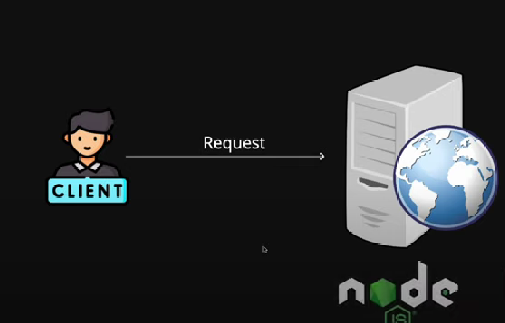
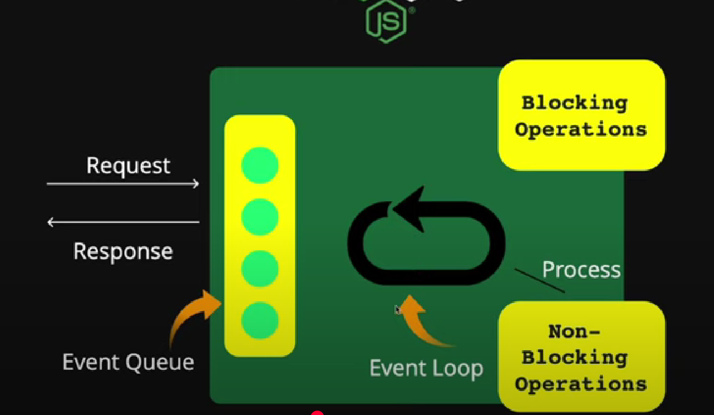
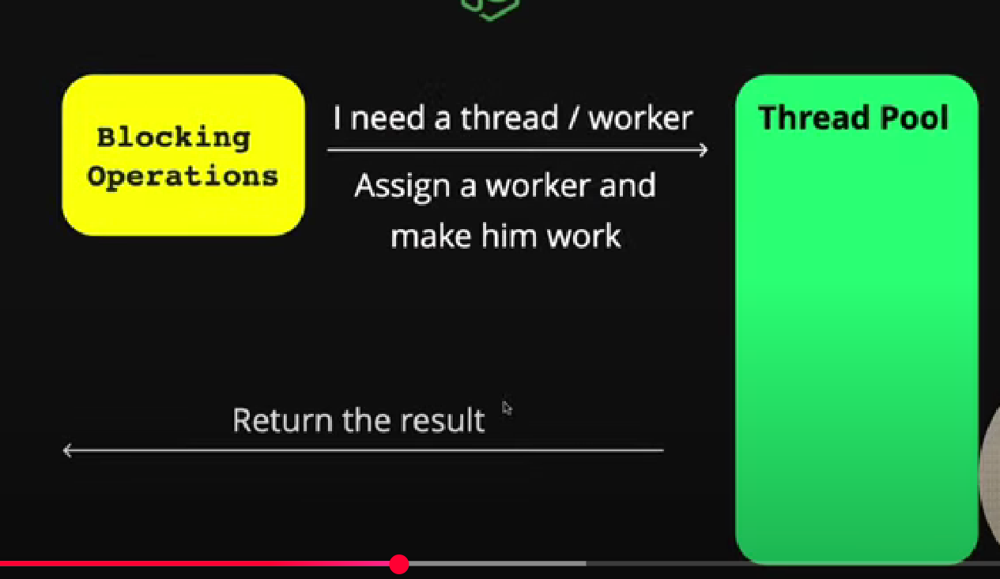
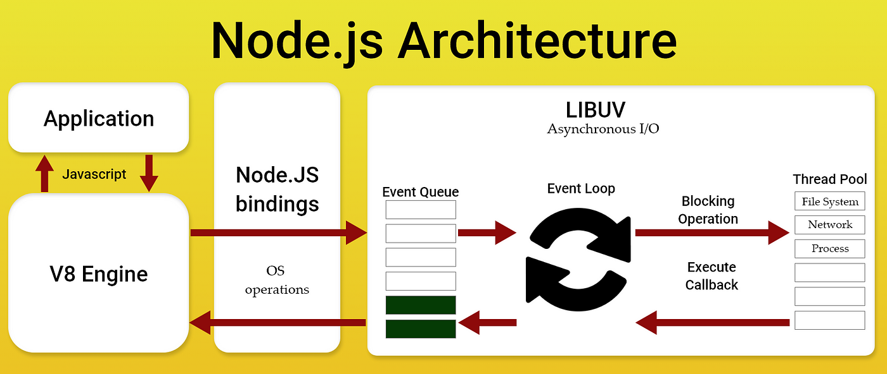

## Node JS

<hr>

**Node JS is javascript run time environment.**
whenever we run `npm init`. it creates **package.json** file.

_this file is actually to maintain our package we going to use in our project._

**All other features which is present for browser are remove and added new feature to run JS locally on system.**

<hr>

### `require` in Node js.

It actually used in node js when we have import any module _(file)_ from our project files.

**Check out file `module.js` and `math.js`**

there `require` is used to access file or module or package. and `module.exports = {}` is used to export values from module to needed file.

## I didnt get suggestions of node packages

✅ Fix IntelliSense for require() in .js files:

1. Install Node.js type definitions
   If you haven’t already:

```bash
npm install --save-dev @types/node
```

2. Create a jsconfig.json in your root directory
   This tells VS Code:

Hey, this is a JavaScript project that uses Node.js types.

Create this file: jsconfig.json

```json
{
  "compilerOptions": {
    "target": "ES6",
    "module": "commonjs",
    "checkJs": true,
    "allowJs": true,
    "types": ["node"]
  },
  "include": ["./**/*.js"]
}
```

## File handling in nodeJS

1. for dealing and interacting with files, we need package **fs** (_file system_) from nodeJS.

below code is from _file system > file.js_

```javascript
const fs = require("fs");

fs.writeFileSync("./test.txt", "Shubham Alhat");
```

**Run this file using `node file.js` cmd in termnal. ensure that you are in that particular directory.**

Here, a file created named **test.txt** with text inside the file `Shubham Alhat`.
just like this, there are

appendFileSync()
readFileSync()

**where it is used - when we have to monitor our server's requests. meaning creating file `log.txt` where we will log our data of user like when he want any request. what was timing?? store his IP address**

<hr>

#### Through fs, we can perform many different operations on file. _And guess what, vanilla javascript doesnt have these features or methods._

<hr>

## Architecture of NodeJS

### How it works internally -

1. It all start with a client (User) who send request to our nodeJS server.



2. then, there is this our nodeJS server. request get into Event queue. works on FIFO principle (_First In First Out_). there is this event loop which watching event queue continously to check any request. if there any request, it takes that request and check it whether it is a blocking (_synchronous_) operation request **OR** non-blocking (_Asynchronous_) operation request.



3. If there is non-blocking (_Async_) request, event loop processes it and send response to client.

4. On the other hand, if there is blocking (sync) request, it passes to **thread pool** which is a pool of threads. **threads:- like worker who works when any work request is there.** blocking request get process by a perticular thread, if there any thread. and send response to client.



**IMP NOTE - there are limited threads (workers). by default there are four threads.**
lets say, in our server, four users sends request one by one and **if you have writte blocking code** then when 5th user sends a request, he have to wait to complete any one process from four to get a thread. **That's why it is important to write non-blocking code.**


